# Part 7 — Automation Architecture Summary

This document describes the **LLM-assisted development-specification pipeline** used by the Buyinz repository, so that any new developer can set it up and reason about it end-to-end.

---

## 1. Pipeline diagram

```mermaid
flowchart LR
    A[Developer opens PR<br/>with label <code>story:&lt;slug&gt;</code>] --> B[Teammate reviews<br/>and approves PR]
    B -->|pull_request_review:submitted<br/>review.state == approved| C[GitHub Actions<br/>Dev Spec &#40;LLM&#41; workflow]
    C --> D{Spec exists for<br/>story:&lt;slug&gt;?}
    D -- No  --> E[Load prompts/<br/>dev-spec-generate.md]
    D -- Yes --> F[Load prompts/<br/>dev-spec-update.md]
    E --> G[scripts/devspec/run-llm.js<br/>calls Anthropic API<br/>with prompt + PR diff]
    F --> G
    G --> H[Writes Buyinz/dev-specs/&lt;slug&gt;.md]
    H --> I[gh issues.create<br/>&#40;tracking Issue&#41;]
    H --> J[peter-evans/create-pull-request<br/>&#40;follow-up spec PR&#41;]
    I --> K[Kanban board<br/>column = Review]
    J --> K
    K --> L[Human reviews spec,<br/>merges into main]
```



---

## 2. Bullet-level pipeline

1. **Trigger.** A pull request is opened on `main` that implements a user story. The author attaches a `story:<slug>` label (e.g. `story:store-profile-and-location`). A teammate reviews the PR and clicks **Approve**.
2. **Event.** GitHub fires `pull_request_review` with `review.state == approved`. The workflow `.github/workflows/dev-spec.yml` (staged at `Buyinz/dev-specs/automation/dev-spec-workflow.yml`) matches this event and the `story:` label.
3. **Check out approved PR.** The job checks out `github.event.pull_request.head.sha` and collects the unified diff against `base.sha` into `pr.diff`. PR title, number, and body go into `pr-context.txt`.
4. **Resolve mode.**
   - If `Buyinz/dev-specs/<slug>.md` already exists → `MODE=update`, prompt = `prompts/dev-spec-update.md`.
   - Otherwise → `MODE=generate`, prompt = `prompts/dev-spec-generate.md`.
5. **LLM call.** `scripts/devspec/run-llm.js` (a small Node wrapper) sends:
   - the selected prompt,
   - the current spec markdown (for updates) or the story context (for generate),
   - `pr.diff` and `pr-context.txt`,
   to Anthropic's Messages API using `ANTHROPIC_API_KEY` from repository secrets. The output markdown is written to `Buyinz/dev-specs/<slug>.md`.
6. **Tracking Issue.** `actions/github-script` calls `issues.create` to open a tracking GitHub Issue titled `Dev spec <mode> for story:<slug> (PR #<n>)` with labels `devspec` + `story:<slug>`. The Issue number is captured for the follow-up PR body so the PR auto-closes it.
7. **Spec PR.** `peter-evans/create-pull-request@v6` commits the generated or updated markdown on branch `docs/devspec-<slug>-pr-<n>`, opens a PR targeting `main`, and labels it `devspec,story:<slug>`.
8. **Human review.** A teammate reviews the spec PR for accuracy (diagrams, byte estimates, PII section), requests edits if needed, and merges. The Kanban automation (GitHub Projects) moves both the tracking Issue and the spec PR through `In Progress → Review → Done`.

---

## 3. Developer setup

Do these once per contributor / once per fork:

### 3.1 Repository secrets
Create a repository secret named **`ANTHROPIC_API_KEY`** (Settings → Secrets and variables → Actions → New repository secret). Any Anthropic key with access to `claude-3-5-sonnet-latest` works; no other scopes are required. GitHub Actions' default `GITHUB_TOKEN` is used for the Issue + PR creation steps, so no personal token is needed.

### 3.2 Labels and Kanban
Create the labels **`devspec`** and one **`story:<slug>`** label per active user story (the workflow keys on them). On the project board (Projects → Board), enable the built-in automations *"Item added to project"* → **Todo**, *"Pull request linked"* → **In Progress**, and *"Pull request merged"* → **Done**.

### 3.3 Local development
```bash
cd Buyinz
npm install                                    # installs Jest + test harness
npm test                                       # runs the unit tests that gate PRs
```
To iterate on prompts locally before committing:
```bash
ANTHROPIC_API_KEY=sk-ant-... \
  node scripts/devspec/run-llm.js \
    --prompt Buyinz/dev-specs/prompts/dev-spec-generate.md \
    --spec   Buyinz/dev-specs/<slug>.md \
    --diff   pr.diff \
    --context pr-context.txt \
    --mode   generate \
    --out    Buyinz/dev-specs/<slug>.md
```

### 3.4 Moving the workflow into place
The canonical copy of the workflow lives in `Buyinz/dev-specs/automation/dev-spec-workflow.yml` (so prompts + automation review as one unit). To activate it, copy it to the repo-root workflow folder — this only needs to happen once, when the automation branch is merged to `main`:
```bash
mkdir -p .github/workflows
cp Buyinz/dev-specs/automation/dev-spec-workflow.yml .github/workflows/dev-spec.yml
git add .github/workflows/dev-spec.yml
git commit -m "ci: activate LLM dev-spec workflow"
```

### 3.5 Opening a PR for a new story
1. Implement the story on a feature branch.
2. Open a PR with a label `story:<slug>` (slug matches the filename you want under `Buyinz/dev-specs/`).
3. When the PR is **approved**, the workflow fires automatically, opens the tracking Issue, and opens the follow-up spec PR.
4. Review the spec PR and merge. No other manual steps.

---

## 4. Why this shape

- **Runs on review approval, not on PR open.** Specs are expensive to generate and noisy to read while code is still churning; reviewing gate keeps the LLM out of the iteration loop.
- **Prompts live in the repo.** They version with the code and appear in every spec PR's diff so reviewers can see *why* a spec looks the way it does.
- **Staging copy of the workflow under `dev-specs/automation/`** keeps prompts and YAML reviewable together. The canonical `.github/workflows/dev-spec.yml` is just a copy activated once.
- **Tracking Issue + spec PR.** The P4 rubric requires both URLs per story — the workflow emits them in a single run and links them to the Kanban board via the `devspec` and `story:<slug>` labels.
