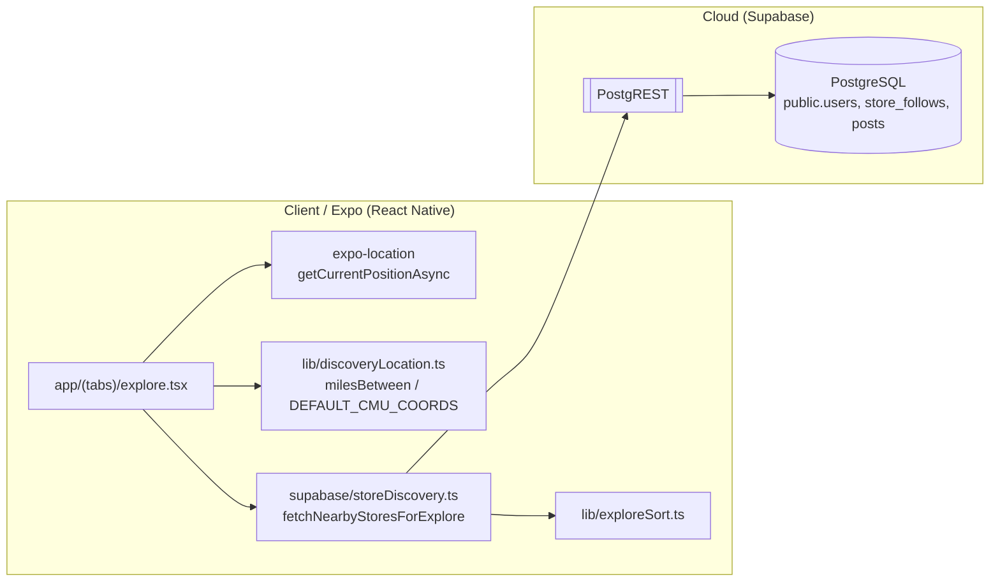
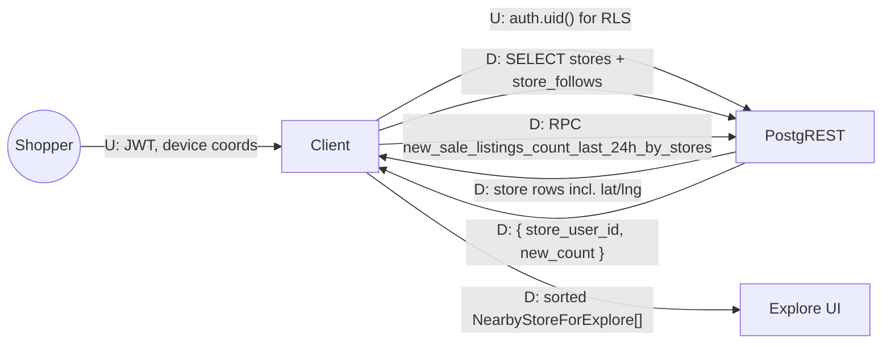
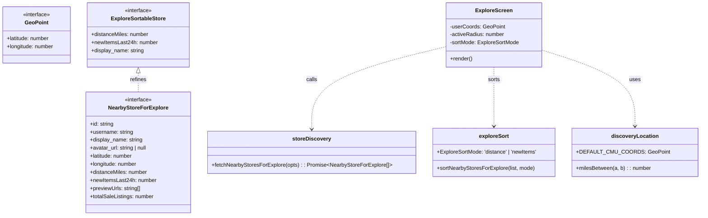

# Development Specification — Distance-Aware Explore Feed

> LLM-generated from PR diffs against `main` using the prompt at
> `Buyinz/dev-specs/prompts/dev-spec-generate.md`. Review for accuracy before merging.

## 1. Ownership & History
- **Primary Owner:** Jenna Gu
- **Secondary Owner:** Buyinz P4 Team
- **Merge Date:** 2026-04-20
- **User Story:** *"As a shopper I want the Explore tab to show stores near me ranked by distance so I can visit the closest ones first."*

## 2. Architectural Diagrams (Mermaid)

### 2.1 Architecture Diagram

### 2.2 Information Flow Diagram

### 2.3 Class Diagram

## 3. Implementation Units

### 3.1 `lib/discoveryLocation.ts`
- **Public**
  - `interface GeoPoint { latitude: number; longitude: number }`
  - `DEFAULT_CMU_COORDS` — fallback center when `expo-location` permission is denied (CMU campus).
  - `milesBetween(a: GeoPoint, b: GeoPoint): number` — pure Haversine distance in statute miles (earth radius 3958.8 mi).
- **Private**: none (module-level function only).

### 3.2 `lib/exploreSort.ts`
- **Public**
  - `ExploreSortMode = 'distance' | 'newItems'`
  - `ExploreSortableStore` — minimal subset of `NearbyStoreForExplore` the sort relies on.
  - `sortNearbyStoresForExplore(list, mode)` — stable sort returning a new array. `'distance'` orders by ascending miles with `display_name` as tiebreaker. `'newItems'` orders by `newItemsLast24h` desc, then miles asc, then name asc.
- **Private**: none.

### 3.3 `supabase/storeDiscovery.ts`
- **Public**
  - `NearbyStoreForExplore` — return shape of the discovery query (coords + distance + new-items count + previews).
  - `fetchNearbyStoresForExplore({ userCoords, radiusMiles }): Promise<NearbyStoreForExplore[]>` — pipeline:
    1. Resolve current user (`supabase.auth.getUser`) and their followed store ids from `store_follows`.
    2. `SELECT id, username, display_name, avatar_url, latitude, longitude FROM users WHERE account_type='store' AND latitude IS NOT NULL AND longitude IS NOT NULL`.
    3. Compute `distanceMiles` per row with `milesBetween`, filter by `radiusMiles`, drop already-followed stores, sort ascending.
    4. Batch-fetch `newItemsLast24h` via `fetchNewSaleListingsCountLast24hBatch` and previews via `fetchStoreSaleListingPreviewsBatch`.
- **Private**: no private state; stateless module.

### 3.4 `app/(tabs)/explore.tsx`
- **Public (internal contracts)**
  - `userCoords`, `activeRadius`, `sortMode` — React state driving the feed.
  - `useEffect` that requests `expo-location.requestForegroundPermissionsAsync`, calls `getCurrentPositionAsync`, subscribes to `watchPositionAsync` with `Accuracy.Balanced`, and falls back to `DEFAULT_CMU_COORDS` when permission is denied.
  - Renders the sorted result of `fetchNearbyStoresForExplore` + `sortNearbyStoresForExplore`.
- **Private**
  - Location subscription cleanup in `useEffect` return.
  - Loading / error UI states.

### 3.5 Partial B-tree `users_latitude_longitude_idx`
Defined in `supabase/migrations/20260418120000_users_account_type_store_address.sql`. Scoped to rows where `latitude IS NOT NULL AND longitude IS NOT NULL`, so it only covers geocoded stores — keeping the index small.

## 4. Dependency & Technology Stack

| Technology | Version | Use here | Rationale | Docs / Author |
|---|---|---|---|---|
| TypeScript | ~5.3 | Entire module. | Static shapes for `GeoPoint`, `NearbyStoreForExplore`. | https://www.typescriptlang.org (Microsoft) |
| React Native | 0.81.4 | Explore UI. | Cross-platform client. | https://reactnative.dev (Meta) |
| Expo SDK | ~54 | Navigation + runtime. | Dev-build + OTA. | https://docs.expo.dev (Expo) |
| `expo-location` | ~19.x | `requestForegroundPermissionsAsync`, `getCurrentPositionAsync`, `watchPositionAsync`. | First-party location module; covers iOS + Android permission prompts. | https://docs.expo.dev/versions/latest/sdk/location (Expo) |
| `@supabase/supabase-js` | ^2.45.x | PostgREST reads; `supabase.rpc`. | Official client. | https://supabase.com/docs/reference/javascript (Supabase Inc.) |
| PostgreSQL | 15.x | `users` geo columns, `store_follows`, `posts`. | Partial index on coordinates. | https://www.postgresql.org (PGDG) |
| Node.js | >=18 | Dev + Jest. | LTS required by Expo and Supabase JS. | https://nodejs.org (OpenJS) |

## 5. Database & Storage Schema

This story reads from three tables; the additive columns belong to the store-profile spec.

| Table / Column | SQL type | Purpose | Approx. bytes/row |
|---|---|---|---|
| `public.users.latitude` | `double precision` | Store coordinate. | 8 B |
| `public.users.longitude` | `double precision` | Store coordinate. | 8 B |
| `public.users.account_type` | `text CHECK IN ('user','store')` | Filter to stores. | 1–6 B |
| `public.store_follows (follower_id, store_id, created_at)` | `uuid, uuid, timestamptz` | Exclude already-followed stores. | ~40 B |
| `public.posts.user_id` | `uuid` | Join for new-items counts. | 16 B |
| `public.posts.type` | `text` (values `'sale'`, ...) | Filter to sale listings. | ~4 B |
| `public.posts.sold` | `boolean` | Active listings only. | 1 B |
| `public.posts.created_at` | `timestamptz` | 24-hour window. | 8 B |

**Supporting indexes**
- `users_latitude_longitude_idx ON public.users (latitude, longitude) WHERE latitude IS NOT NULL AND longitude IS NOT NULL` — supports the discovery `SELECT`.
- `posts_store_active_created_at_idx ON public.posts (user_id, created_at DESC) WHERE type = 'sale' AND sold = false` — supports the RPC that drives `newItemsLast24h`.

## 6. Resilience & Failure Modes

| Scenario | User-visible effect | Internal effect |
|---|---|---|
| Process crash | Explore re-fetches on relaunch; location re-requested. | Watch subscription auto-cancels via `useEffect` cleanup. |
| Lost runtime state | No stale pins on the map; next render recomputes. | Pure functions (`milesBetween`) make recovery deterministic. |
| Erased stored data | Explore shows "no stores near you" until stores re-add addresses. | Query returns 0 rows after filter. |
| Database corruption | Generic error banner; retry button. | Supabase client throws; caller surfaces message. |
| RPC failure | Badges show "0 new today"; main list still renders if the main SELECT succeeded. | `fetchNewSaleListingsCountLast24hBatch` error bubbles; caller may catch per story-level UX decision. |
| Client overloaded | Discover spinner stays on; user can pull-to-refresh. | Result is deterministic; retrying is safe. |
| Out of RAM | App killed; cold start rebuilds state. | No partial DB writes — read-only path. |
| Database out of space | Not applicable to this read-only feature. | Reads still succeed. |
| Network loss | "No connection" banner; fallback is the previously-rendered list. | Fetch rejects; state falls back to `DEFAULT_CMU_COORDS`. |
| Database access loss | Same as network loss. | Supabase client logs 5xx. |
| Bot spamming | Rate-limited reads are harmless; no write surface here. | PostgREST rate-limits or RLS will mitigate. |
| GPS permission denied | UI shows "Showing CMU area" and centers on `DEFAULT_CMU_COORDS`. | No `watchPositionAsync` subscription. |

## 7. PII & Security (Privacy Analysis)

### PII stored / flowing
- Shopper device **coarse location** (lat/lng from `expo-location`) — held in RAM only, never written to the database.
- Store coordinates — already public-ish per the store-profile spec; shown on the Explore UI.
- `auth.uid()` (JWT) — sent with every PostgREST request for RLS.

### Data lifecycle
1. `expo-location` produces a `GeoPoint` on the client.
2. `fetchNearbyStoresForExplore` uses it only to compute `distanceMiles` and radius-filter store rows. The coordinate **is not uploaded**.
3. Store rows returned by PostgREST are projected into `NearbyStoreForExplore` and sorted in memory.
4. The list is rendered; on screen unmount / location change it is recomputed.

### Retention
- Nothing created by this feature is persisted on the server. Local caches (React Query / in-memory) are dropped when the screen unmounts.

### Responsibility and audit
- **DB security:** repo maintainer on call for migrations.
- **Audit:** Supabase PostgREST logs; no new custom endpoints.

### Minors
- Shoppers as young as 13 may use the app. We never persist their device coordinates, so the risk surface here is limited to *transient* location-aware queries. The Explore UI does not display real-time location to other users.

---

## Revision history
| Date | Change | Source PR |
|---|---|---|
| 2026-04-20 | Initial generation from `main` after distance-aware explore + store follows merged. | TBD |
