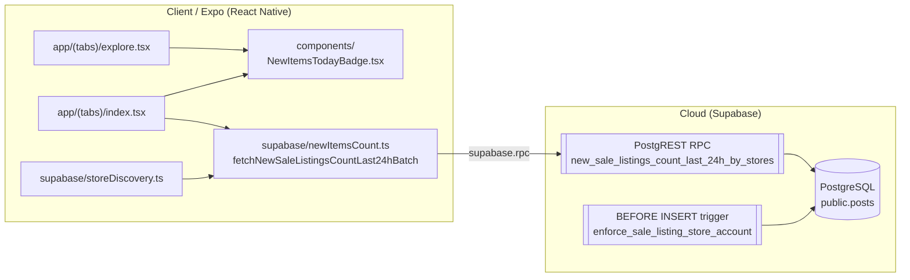
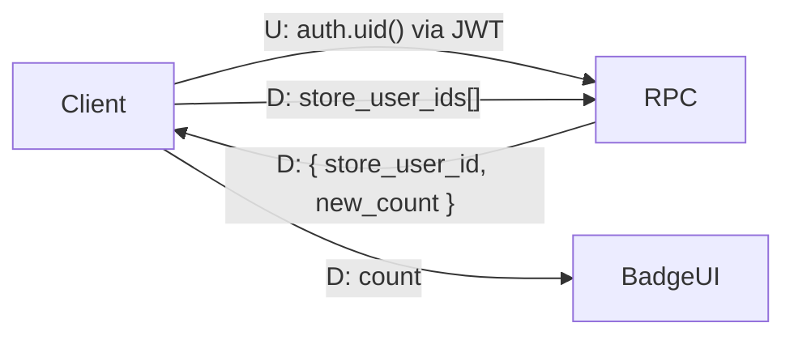
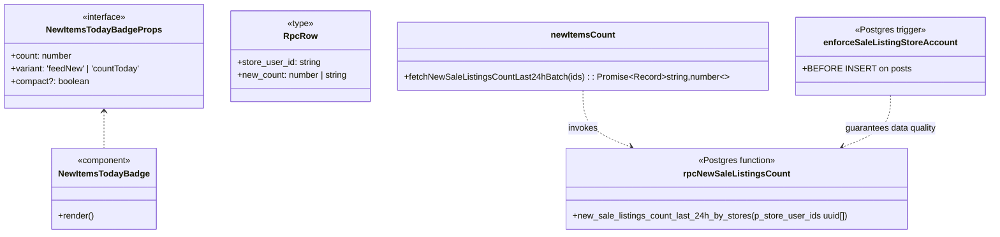

# Development Specification — New Items Today Count

> LLM-generated from PR diffs against `main` using the prompt at
> `Buyinz/dev-specs/prompts/dev-spec-generate.md`. Review for accuracy before merging.

## 1. Ownership & History
- **Primary Owner:** Jenna Gu
- **Secondary Owner:** Buyinz P4 Team
- **Merge Date:** 2026-04-20
- **User Story:** *"As a shopper I want each store card to show how many new items it has today so I can tell which thrift stores are worth visiting right now."*

## 2. Architectural Diagrams (Mermaid)

### 2.1 Architecture Diagram

### 2.2 Information Flow Diagram

### 2.3 Class Diagram

## 3. Implementation Units

### 3.1 `supabase/newItemsCount.ts`
- **Public**
  - `fetchNewSaleListingsCountLast24hBatch(storeUserIds: string[]): Promise<Record<string, number>>` — dedupes input, calls `supabase.rpc('new_sale_listings_count_last_24h_by_stores', { p_store_user_ids })`, and returns a map keyed by `store_user_id` with missing entries defaulting to 0.
- **Private**
  - `type RpcRow = { store_user_id: string; new_count: number | string }` — narrows the RPC payload for the number coercion in `Number(row.new_count)`.

### 3.2 `components/NewItemsTodayBadge.tsx`
- **Public**
  - `Props { count: number; variant: 'feedNew' | 'countToday'; compact?: boolean }`
  - `NewItemsTodayBadge(props)` — React component. Returns `null` when `count <= 0`. Otherwise renders a pill showing either `"New"` (feed header on a listing card) or `"{count} new today"` (store card on Explore).
- **Private**
  - `styles` stylesheet; `useColorScheme` for the dark/light brand tint.

### 3.3 `supabase/migrations/20260419130000_posts_store_enforcement_and_new_count_rpc.sql`
- **Public (DB contract)**
  - `public.enforce_sale_listing_store_account()` — `BEFORE INSERT` trigger on `public.posts`. Rejects `type='sale'` inserts unless `auth.uid()` is the row's `user_id` **and** `public.users.account_type = 'store'`.
  - `public.new_sale_listings_count_last_24h_by_stores(p_store_user_ids uuid[])` — `SECURITY DEFINER`, `STABLE`, returns `(store_user_id uuid, new_count bigint)` grouped by store. Counts active sale posts created within the rolling 24 hours.
  - Execute grant: `authenticated, anon` (read-only, no PII beyond public counts).
- **Private / internal**
  - Index `posts_store_active_created_at_idx ON public.posts (user_id, created_at DESC) WHERE type = 'sale' AND sold = false` — backs the RPC's time-window scan.

### 3.4 Call sites
- `supabase/storeDiscovery.ts` → reads the map and attaches `newItemsLast24h` to every `NearbyStoreForExplore`.
- `app/(tabs)/explore.tsx` → renders `<NewItemsTodayBadge variant="countToday" count={store.newItemsLast24h} />`.
- `app/(tabs)/index.tsx` → renders `<NewItemsTodayBadge variant="feedNew" .../>` on followed-store feed headers.

## 4. Dependency & Technology Stack

| Technology | Version | Use here | Rationale | Docs / Author |
|---|---|---|---|---|
| TypeScript | ~5.3 | Client + types. | Narrow `RpcRow`. | https://www.typescriptlang.org (Microsoft) |
| React Native | 0.81.4 | Badge component. | Cross-platform UI. | https://reactnative.dev (Meta) |
| Expo SDK | ~54 | Theme + color-scheme hook. | Matched to rest of app. | https://docs.expo.dev (Expo) |
| `@supabase/supabase-js` | ^2.45.x | `supabase.rpc(...)`. | Official client; typed RPC invocation. | https://supabase.com/docs/reference/javascript (Supabase Inc.) |
| PostgreSQL | 15.x | Trigger + RPC + partial index. | Single SECURITY DEFINER function is cheap and indexable. | https://www.postgresql.org (PGDG) |
| Node.js | >=18 | Dev / Jest. | LTS. | https://nodejs.org (OpenJS) |

## 5. Database & Storage Schema

This feature is **read-heavy**; the only new persistent object is an **index**.

| Object | Purpose | Approx. size |
|---|---|---|
| `posts_store_active_created_at_idx` | Partial B-tree on `(user_id, created_at DESC)` restricted to `type='sale' AND sold=false`. Supports the rolling 24h scan per store. | ~20 B / indexed tuple × active sale listings. Partial → only covers active listings. |
| `public.enforce_sale_listing_store_account()` | Pre-insert guard on `public.posts`. No storage. | 0 B / row; small plpgsql catalog entry. |
| `public.new_sale_listings_count_last_24h_by_stores(uuid[])` | SQL function returning `(uuid, bigint)`. No storage. | 0 B / row. |

**Per-RPC result row:** `uuid (16 B) + bigint (8 B) + row overhead ≈ 24 B` returned to the client per store.

## 6. Resilience & Failure Modes

| Scenario | User-visible effect | Internal effect |
|---|---|---|
| Process crash | Badge disappears until next render; recomputed. | No client state survives; RPC is idempotent. |
| Lost runtime state | Same as above. | `fetchNewSaleListingsCountLast24hBatch` is pure w.r.t. server state. |
| Erased stored data | All counts 0 until new listings land. | RPC returns empty rows; code fills with 0 by default. |
| Database corruption | `supabase.rpc` throws; badge hides. | Surfaced in caller's error handler. |
| RPC failure | Explore shows stores without badges (count defaults to 0). | `throw error` bubbles; caller may swallow for progressive enhancement. |
| Client overloaded | UI renders 0 badge until the request completes. | Stateless call. |
| Out of RAM | App killed; recomputed on cold start. | — |
| Database out of space | Sale inserts fail (trigger already requires a store account; insert fails earlier with space error). | Count RPC unaffected by write failures. |
| Network loss | Badge hides (count=0) with no error banner — degrades gracefully. | Network error swallowed per call-site policy. |
| Database access loss | Same as network loss. | Supabase client logs the 5xx. |
| Bot spamming listings | `enforce_sale_listing_store_account` rejects inserts from non-store accounts. Count is bounded by what real stores publish. | Trigger raises `'Only store accounts can create sale listings'`. |
| Clock skew | 24h window uses `now()` server-side, so client clock can't influence counts. | Deterministic. |

## 7. PII & Security (Privacy Analysis)

### PII stored
- None new. Reads aggregate existing `posts` rows. No identifiers are returned beyond the `store_user_id`, which is already public for store accounts.

### Data lifecycle
1. A store account inserts a sale post. The `BEFORE INSERT` trigger checks `auth.uid() == NEW.user_id` and `users.account_type = 'store'`.
2. The post lands in `public.posts`.
3. The RPC aggregates active sale posts created in the last 24h per store, runs as `SECURITY DEFINER` to bypass RLS so unauthenticated shoppers can see counts on the Explore tab.
4. Counts are rendered on the client; not cached server-side.

### Retention
- No new persisted data. Counts are derived from existing `posts` rows whose retention policy is defined elsewhere (listings persist until sold or user-deleted).

### Responsibility and audit
- **DB security:** the maintainer on call for migrations. The `SECURITY DEFINER` function is audited because it bypasses RLS; its `GRANT EXECUTE` is deliberately restricted to `authenticated` and `anon`.
- **Audit:** Supabase RPC call logs; GitHub Actions workflow logs for migration deploys.

### Minors
- No new PII about minors. Shoppers receive aggregate counts only.

---

## Revision history
| Date | Change | Source PR |
|---|---|---|
| 2026-04-20 | Initial generation from `main` after new-item-count migration + badge component merged. | TBD |
