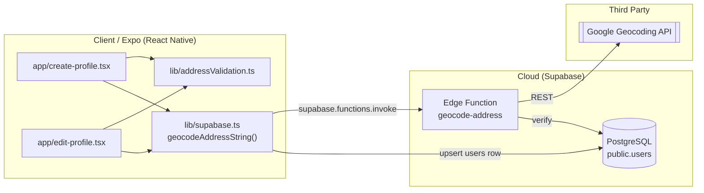
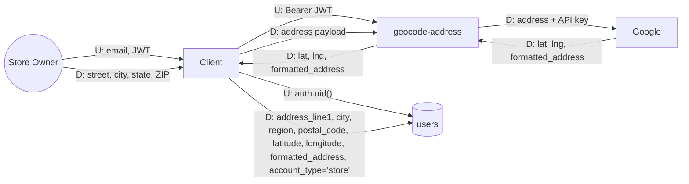
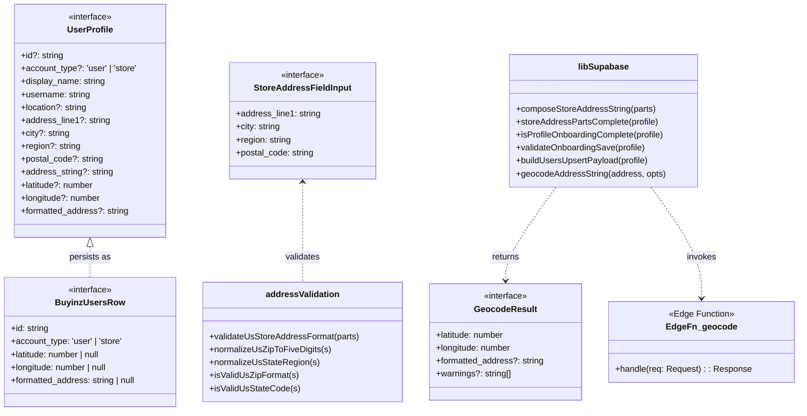

# Development Specification — Store Profile + Location

> LLM-generated from PR diffs against `main` using the prompt at
> `Buyinz/dev-specs/prompts/dev-spec-generate.md`. Review for accuracy before merging.

## 1. Ownership & History
- **Primary Owner:** Jenna Gu
- **Secondary Owner:** Buyinz P4 Team
- **Merge Date:** 2026-04-20
- **User Story:** *"As a thrift store owner I want to create a store account with a verified physical address so shoppers can find me on the map."*

## 2. Architectural Diagrams (Mermaid)

### 2.1 Architecture Diagram

### 2.2 Information Flow Diagram

- **U** = user-identifying (JWT / `auth.uid()`).
- **D** = application data (address strings, coordinates).

### 2.3 Class Diagram

## 3. Implementation Units

### 3.1 `lib/addressValidation.ts`
- **Public**
  - `normalizeUsZipToFiveDigits(input: string): string` — reduces input to the first 5 digits for comparison with the geocoder's `postal_code` component.
  - `isValidUsZipFormat(input: string): boolean` — regex check for `NNNNN` or `NNNNN-NNNN`.
  - `normalizeUsStateRegion(input: string): string` — uppercases the first two characters.
  - `isValidUsStateCode(input: string): boolean` — regex for two letters.
  - `validateUsStoreAddressFormat(parts: StoreAddressFieldInput): { ok: true } | { ok: false; message: string }` — format-only validation prior to the geocoder call; does not prove deliverability.
  - `StoreAddressFieldInput` — the input shape expected by the validator.
- **Private**
  - `MAX_STREET_LEN`, `MAX_CITY_LEN`, `MIN_CITY_LEN`, `US_ZIP_REGEX`, `US_STATE_REGEX` — file-local constants.

### 3.2 `lib/supabase.ts` (store subset)
- **Public**
  - `type AccountType = 'user' | 'store'`
  - `interface UserProfile` with address fields.
  - `composeStoreAddressString(parts)` — joins `line1, city, region, zip` with commas.
  - `storeAddressPartsComplete(profile)` — all 4 address fields non-empty.
  - `isProfileOnboardingComplete(profile)` — shoppers need name + username; stores additionally need full address + numeric `latitude` & `longitude`.
  - `validateOnboardingSave(profile)` / `validateProfileForSave(profile)` — throws with human-readable messages when required fields are missing.
  - `buildUsersUpsertPayload(profile)` — maps a `UserProfile` into the `public.users` row shape; clears address columns for shoppers.
  - `geocodeAddressString(address, { expectedPostalCode?, expectedRegion? })` — invokes the `geocode-address` Edge Function with the active session JWT and returns `{ latitude, longitude, formatted_address, warnings? }`.
  - `BuyinzUsersRow` type + `BUYINZ_USER_ROW_SELECT` constant — canonical row shape for reads.
- **Private**
  - `storeProfileCoreComplete` — internal helper used by `isProfileOnboardingComplete`.
  - `messageFromFunctionsError` — normalizes Edge Function errors into user-facing copy.

### 3.3 `supabase/usersRead.ts`
- **Public**
  - `PublicUserProfile` — the safe, publicly-readable projection of a user row (includes the store address columns).
  - `storeProfileAddressLine(profile)` — chooses the best available line: `formatted_address` → composed parts → legacy `location`.
  - `fetchUserPublicProfileById(userId)` — single-row read of a public profile by id.
- **Private**: none.

### 3.4 `supabase/functions/geocode-address/index.ts`
- **Public (HTTP contract)**
  - `POST { address, expected_postal_code?, expected_region? }` → `200 { latitude, longitude, formatted_address, warnings? }`.
  - Requires `Authorization: Bearer <supabase access_token>`; rejects anonymous callers with 401.
- **Private**
  - `zipToFiveDigits`, `normalizeStateTwoLetter`, `extractPostalAndState` — helpers for postal / state component parsing from Google's response.
  - `GOOGLE_MAPS_GEOCODING_API_KEY` (Edge Function secret) — server-side API key; never leaves the Edge runtime.

### 3.5 `app/create-profile.tsx` and `app/edit-profile.tsx`
- **Public (internal state contracts)**
  - `accountType`, `street`, `city`, `state`, `zip`, `latitude`, `longitude`, `formattedAddress` — form state that maps 1-to-1 onto `UserProfile`.
  - `handleSave()` — runs `validateUsStoreAddressFormat`, then `geocodeAddressString`, then `buildUsersUpsertPayload` + Supabase upsert.
- **Private**: per-field validation error state, submit-in-flight flag, analytics.

## 4. Dependency & Technology Stack

| Technology | Version | Use here | Rationale | Docs / Author |
|---|---|---|---|---|
| TypeScript | ~5.3 | All client + Edge code. | Static types across the `UserProfile` / `BuyinzUsersRow` boundary. | https://www.typescriptlang.org (Microsoft) |
| React Native | 0.81.4 | `create-profile.tsx`, `edit-profile.tsx`. | Shared iOS + Android client. | https://reactnative.dev (Meta) |
| Expo SDK | ~54 | Dev build + routing. | Bundler + OTA for the app. | https://docs.expo.dev (Expo) |
| `@supabase/supabase-js` | ^2.45.x | `supabase.functions.invoke`, `supabase.from('users').upsert`. | Official client. | https://supabase.com/docs/reference/javascript (Supabase Inc.) |
| Supabase Edge Runtime (Deno) | latest | `geocode-address` function. | Keeps the Google API key server-side. | https://supabase.com/docs/guides/functions (Supabase Inc.) |
| Google Geocoding API | v1 | Street + ZIP → lat/lng + formatted address. | Mature, Carnegie Mellon covers free tier. | https://developers.google.com/maps/documentation/geocoding (Google) |
| PostgreSQL | 15.x (Supabase-managed) | `public.users` store columns. | First-class geospatial filter via `latitude`/`longitude` index. | https://www.postgresql.org (PGDG) |
| Node.js | >=18 | Local development, Jest tests. | LTS supported by Expo and Supabase JS. | https://nodejs.org (OpenJS) |

## 5. Database & Storage Schema

`public.users` additions introduced by `supabase/migrations/20260418120000_users_account_type_store_address.sql`:

| Column | SQL type | Purpose | Approx. bytes/row |
|---|---|---|---|
| `account_type` | `text NOT NULL DEFAULT 'user'` + `CHECK IN ('user','store')` | Discriminator between shopper and store. | 1–6 (typically `'user'` or `'store'`) |
| `address_line1` | `text` | Store street. | 0–120 chars (~avg 32 B) |
| `city` | `text` | Store city. | 0–80 chars (~avg 12 B) |
| `region` | `text` | 2-letter state/region. | 2 B |
| `postal_code` | `text` | 5- or 10-char ZIP. | 5–10 B |
| `address_string` | `text` | Composed `line1, city, region, zip`. | ~50 B avg |
| `latitude` | `double precision` | Geocoded latitude. | 8 B |
| `longitude` | `double precision` | Geocoded longitude. | 8 B |
| `formatted_address` | `text` | Verified line from Google. | ~60 B avg |

**Per-store row overhead for these additions:** roughly **~180 B** (plus tuple header) when all fields are populated. Shoppers leave them `NULL`, so the cost is close to zero.

**Index:** `users_latitude_longitude_idx on public.users (latitude, longitude) WHERE latitude IS NOT NULL AND longitude IS NOT NULL` — partial B-tree that only covers stores; powers the distance-aware explore query.

## 6. Resilience & Failure Modes

| Scenario | User-visible effect | Internal effect |
|---|---|---|
| Process crash (app) | Unsaved address form state is lost; next launch re-prompts. | No DB writes; Supabase session persists via SecureStore. |
| Lost runtime state | Same as above; geocode result is re-fetched on retry. | No cost beyond an extra Google API call. |
| Erased stored data | Store drops off the map until address is re-entered. | Row remains, `latitude`/`longitude` become `NULL`; `isProfileOnboardingComplete` returns false. |
| Database corruption | Profile cannot save; UI shows the Postgres error message. | RLS-independent corruption is out of scope; rely on managed backups. |
| RPC failure (Edge Function 5xx) | Toast: "That search only matched a general area" or "Internal error". | `geocodeAddressString` throws; form stays in edit mode. |
| Client overloaded | Save spinner hangs until the Edge Function times out (default 60s). | `supabase.functions.invoke` throws; user can retry. |
| Out of RAM | App may be killed by OS; same as process crash. | Nothing persisted without a successful upsert. |
| Database out of space | `upsert` fails with Postgres error; toast surfaces it. | No partial write thanks to single-row upsert. |
| Network loss | Friendly message asks the user to try again. | No calls fire; form state preserved in memory. |
| Database access loss | Owner cannot complete onboarding. | Edge Function logs the Supabase auth failure. |
| Bot spamming signups | Signup rate-limit triggers (Supabase default 3/hour/email). | `authenticate()` surfaces a tailored error; no address data was collected yet. |

## 7. PII & Security (Privacy Analysis)

### PII stored
- Business name (`display_name`) and handle (`username`).
- **Physical address**: `address_line1`, `city`, `region`, `postal_code`, `address_string`, `formatted_address`.
- Geocoded `latitude` / `longitude` (quasi-PII for a store; publicly discoverable).
- Auth-layer: email and hashed password in `auth.users` (managed by Supabase).

### Data lifecycle
1. Owner types the address in `create-profile.tsx` → held in component state only.
2. `validateUsStoreAddressFormat` filters obviously bad input client-side.
3. Client calls `geocodeAddressString` → Edge Function `geocode-address` → Google Geocoding API. The API key lives only in the Edge secret; it never reaches the client.
4. On success, `buildUsersUpsertPayload` writes `latitude`, `longitude`, and the verified address strings into `public.users`.
5. Reads happen via `fetchUserPublicProfileById` / the discovery feed and are RLS-checked by Supabase.

### Retention
- Addresses persist until the store owner edits or deletes their account. Deleting an account removes the `users` row (and the address columns fall away with it).
- `latitude`/`longitude` are required for the store to be discoverable; without them the row is treated as "unverified" by `isProfileOnboardingComplete`.

### Responsibility and audit
- **Database security:** the repository maintainer on call for migrations (currently the P4 team lead).
- **Audit:** Supabase access logs + GitHub Actions logs for workflow-driven writes. Secrets are rotated via the Supabase dashboard.

### Minors
- The app does not knowingly collect data for users under 18. Store onboarding is assumed to be performed by adult business owners. The Terms of Service disclaim use by minors; no additional mitigations beyond the age-gate on signup.

---

## Revision history
| Date | Change | Source PR |
|---|---|---|
| 2026-04-20 | Initial generation from `main` after three PRs merged (`users.account_type`, address columns, `geocode-address` Edge Function). | TBD (see tracking Issue) |
