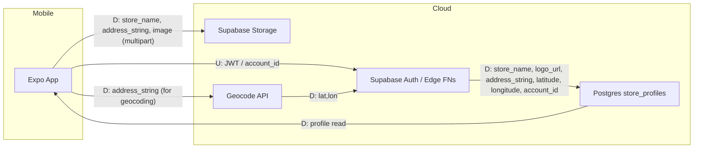

✗ Read package.json
  └ Path does not exist

● Search (glob)
  │ "**/package.json"
  └ 1 file found

● Read package.json
  │ Buyinz/package.json
  └ 70 lines read

# Development Specification — Store Profile & Location Setup (Store Side)

### 1. Ownership & History
* **Primary Owner:** cozey7 (GitHub username; opened the implementation PR)  
* **Secondary Owner:** BigBoa19 (GitHub username; merged the PR, or if not yet merged, the approving reviewer)  
* **Merge Date:** 2026-04-19

---

### 2. Architectural Diagrams (Mermaid)

Architecture Diagram (execution zones: Client / Mobile Device vs Cloud / Supabase)
```mermaid
flowchart LR
  subgraph Client["Mobile Device (Expo / React Native)"]
    direction TB
    A[StoreProfileScreen<br/>StoreProfileForm] --> B[LogoUploader<br/>(multipart)]
    A --> C[AddressInput + MapPreview]
    A --> D[Auth (JWT via Supabase Auth)]
  end

  subgraph Cloud["Cloud / Supabase"]
    direction TB
    E[Supabase PostgREST / Edge Functions] --> F[Supabase Storage (logo bucket)]
    E --> G[Postgres DB (store_profiles table)]
    E --> H[Server-side Geocode Service or Edge Function calling external Geocoding API]
  end

  D -. Auth U .-> E
  B -- multipart upload --> F
  C -- address string (D) --> H
  H -- lat/lon (D) --> E
  E -- persist (D) --> G
```

Information Flow Diagram (label flows "U" = User Identifying Information, "D" = Application Data)


Class Diagram (TypeScript interfaces / classes relevant to the story)
```mermaid
classDiagram
  %% Interfaces / Types
  class StoreProfileRow {
    <<record>>
    +id: string
    +account_id: string
    +store_name: string
    +logo_url: string
    +address_string: string
    +latitude: number
    +longitude: number
    +created_at: string
    +updated_at: string
  }

  class StoreProfileInput {
    <<interface>>
    +store_name: string
    +address_string: string
    +logo_file?: File
  }

  class GeocodeResult {
    <<interface>>
    +latitude: number
    +longitude: number
    +confidence?: number
    +raw?: any
  }

  class IProfileService {
    <<interface>>
    +createProfile(input: StoreProfileInput, accountId: string): Promise<StoreProfileRow>
    +updateProfile(id: string, input: Partial<StoreProfileInput>): Promise<StoreProfileRow>
    +getProfileForAccount(accountId: string): Promise<StoreProfileRow | null>
  }

  class StoreProfileService {
    +constructor(supabaseClient)
    +createProfile(input, accountId)
    +updateProfile(id, input)
    +getProfileForAccount(accountId)
    -uploadLogo(file): Promise<string>
    -geocodeAddress(address): Promise<GeocodeResult>
  }

  class StoreProfileForm {
    +render()
    +validate(): ValidationResult
    +submit()
    -state: {name, address, logoFile, errors}
    -mapPreviewRef
  }

  %% Relationships
  IProfileService <|.. StoreProfileService
  StoreProfileService o-- GeocodeResult : uses
  StoreProfileForm --> StoreProfileService : calls
  StoreProfileRow <|-- StoreProfileInput
```

---

### 3. Implementation Units (Classes / Interfaces / Modules)

Group: UI Components (React Native / Expo)
- StoreProfileScreen (functional component)
  - Public:
    - props: { navigation, route }
    - render(): JSX.Element — shows StoreProfileForm and preview
  - Private:
    - state: { loading: boolean, savedProfile?: StoreProfileRow }
    - effects: load existing profile on mount

- StoreProfileForm (component)
  - Public:
    - props: { initial?: StoreProfileRow, onSaved?: (row) => void }
    - submit(): Promise<void> — triggers validation, upload, geocode, save
    - validate(): { valid: boolean, errors: Record<string,string> }
  - Private:
    - state: { store_name: string, address_string: string, logoFile?: File, errors: {} }
    - helpers:
      - handleImagePicked(file)
      - showValidationError(field, message)
      - disableSubmitWhileUploading

- LogoUploader (component)
  - Public:
    - props: { onFileSelected: (File) => void, value?: string }
    - render(): JSX
  - Private:
    - state: { uploading: boolean }
    - helpers:
      - pickFromGallery()
      - captureWithCamera()
      - previewImage(uri)

- AddressInput (component)
  - Public:
    - props: { value?: string, onChange: (s:string)=>void }
  - Private:
    - state: { suggestions: string[] }
    - helpers:
      - debounceAddressInput
      - optionally fetch suggestions (if implemented)

- MapPreview (component)
  - Public:
    - props: { latitude: number, longitude:number }
    - render()
  - Private:
    - helper to compute map markers

Group: Services / API
- StoreProfileService (class implementing IProfileService)
  - Public:
    - constructor(supabaseClient: SupabaseClient)
    - createProfile(input: StoreProfileInput, accountId: string): Promise<StoreProfileRow>
    - updateProfile(id: string, input: Partial<StoreProfileInput>): Promise<StoreProfileRow>
    - getProfileForAccount(accountId: string): Promise<StoreProfileRow | null>
  - Private:
    - uploadLogo(file: File): Promise<string> — multipart upload to Supabase Storage, returns URL
    - geocodeAddress(address: string): Promise<GeocodeResult> — call geocoding provider (server-side preferred)
    - validateAddressConfidence(res: GeocodeResult): boolean
    - performDbInsert(row): Promise<StoreProfileRow>

- GeocodeService (module)
  - Public:
    - geocode(address: string): Promise<GeocodeResult>
  - Private:
    - provider selection (e.g., Google Maps, Mapbox, OpenCage)
    - rate-limit/backoff logic
    - retries and error mapping

- StorageService (module; wrapper for Supabase Storage)
  - Public:
    - upload(bucket: string, path: string, file: File, opts?): Promise<{ publicUrl: string }>
  - Private:
    - generateSafePath(accountId, filename)
    - setMetadata / content-type

Group: Types & Queries
- types.ts
  - Exports:
    - StoreProfileRow (see class diagram)
    - StoreProfileInput
    - GeocodeResult

- queries.ts (thin client-side wrappers)
  - Public:
    - insertStoreProfile(row): Promise<StoreProfileRow>
    - updateStoreProfile(id, patch): Promise<StoreProfileRow>
    - selectStoreProfileByAccount(accountId): Promise<StoreProfileRow | null>
  - Private:
    - buildUpsertPayload

Group: Edge Functions / Server-side hooks
- profile-edge-create (Edge Function)
  - Public:
    - HTTP POST handler to accept validated request (account_id authenticated via Supabase JWT)
    - Performs server-side geocoding (optional), persists row, returns saved row
  - Private:
    - auth verification (verify JWT)
    - transaction handling (upload URL + insert in single logical flow)

Testing / E2E
- tests/storeProfile.spec.ts
  - Public:
    - tests for validation errors (missing name/address)
    - test for successful multipart upload + DB insert (mock supabase)
  - Private:
    - fixtures for sample address strings
    - mocks for geocode provider

Documentation
- docs/store-profile.md — user-facing flow and API contract (create/update/get)

---

### 4. Dependency & Technology Stack

Note: required versions taken from Buyinz/ package.json (root: Buyinz/package.json). Where package.json does not specify Node.js, a recommended LTS is listed.

| Technology | Required Version (from package.json) | Specific usage in this story | Rationale | Docs / Source (Author) |
|---|---:|---|---|---|
| TypeScript | ~5.9.2 (devDependency) | Type-safe interfaces for StoreProfileRow, services, component props | Strong typing for data contracts and API surfaces | https://www.typescriptlang.org/ (Microsoft) |
| React Native | 0.81.5 (dependency) | Mobile UI, forms, image picking, map preview | Standard cross-platform mobile framework; matches Expo SDK compatibility | https://reactnative.dev/ (Meta) |
| Expo SDK (expo) | ~54.0.33 (dependency) | App runtime, image-picker, location, build tooling | Simplifies device APIs and builds; integrates with React Native managed workflow | https://docs.expo.dev/ (Expo) |
| @supabase/supabase-js | ^2.100.0 (dependency) | Auth (JWT), PostgREST/Edge Functions, Storage (logo upload), Postgres client | First-class JS client for Supabase services; simplifies uploads and DB access | https://supabase.com/docs/reference/javascript (Supabase) |
| Node.js | Not specified in package.json (recommend >=18 LTS) | Local dev tooling, build scripts, edge functions, server-side geocoding | Modern LTS with native fetch and stable ESM support | https://nodejs.org/ (OpenJS Foundation) |
| expo-location | ~19.0.8 | optional: preview context for map positioning, permission helpers | Use if showing current location while setting store address | https://docs.expo.dev/versions/latest/sdk/location/ (Expo) |
| expo-image-picker | ~17.0.10 | pick logo from gallery/camera | Standard Expo picker | https://docs.expo.dev/versions/latest/sdk/imagepicker/ (Expo) |
| supabase (cli / dev plugin) | ^2.92.1 (devDependency) | local testing / supabase utilities | Developer workflow | https://supabase.com/ (Supabase) |

Rationale summary:
- Supabase chosen for integrated Auth, Storage, and Postgres—reduces infrastructure and keeps the entire flow within a single vendor with first-class JS SDK.
- Expo chosen for rapid mobile development, consistent device APIs, and simple image picking and location modules.
- TypeScript enforces safe contracts between components, services, and DB rows.

---

### 5. Database & Storage Schema

Primary table: store_profiles

SQL DDL (representative)
```sql
CREATE TABLE public.store_profiles (
  id UUID PRIMARY KEY DEFAULT gen_random_uuid(),
  account_id UUID NOT NULL REFERENCES auth.users(id),
  store_name TEXT NOT NULL,
  logo_url TEXT,
  address_string TEXT NOT NULL,
  latitude DOUBLE PRECISION NOT NULL,
  longitude DOUBLE PRECISION NOT NULL,
  created_at TIMESTAMPTZ DEFAULT now(),
  updated_at TIMESTAMPTZ DEFAULT now()
);
CREATE INDEX ON public.store_profiles (account_id);
```

Fields, SQL types, and purpose:
- id — UUID (uuid, 16 bytes) — primary key for the store profile row.
- account_id — UUID (uuid, 16 bytes) — the authenticated owner account id; foreign-key to auth.users.
- store_name — TEXT — public display name for the store.
- logo_url — TEXT — publicly-accessible (or signed) URL to the logo image in Supabase Storage.
- address_string — TEXT — the raw address string entered by owner (street, city, region, postal).
- latitude — DOUBLE PRECISION (8 bytes) — geocoded latitude for mapping/pin.
- longitude — DOUBLE PRECISION (8 bytes) — geocoded longitude for mapping/pin.
- created_at — TIMESTAMPTZ (8 bytes) — record creation timestamp.
- updated_at — TIMESTAMPTZ (8 bytes) — last-modified timestamp.

Storage Estimation (approximate, bytes per row)
- UUID id: 16
- UUID account_id: 16
- store_name TEXT: average 64 (conservative)
- logo_url TEXT: average 200 (varies by CDN URL)
- address_string TEXT: average 200
- latitude: 8
- longitude: 8
- created_at: 8
- updated_at: 8
- Postgres per-row header & TOAST pointers, alignment, index overhead: ~40
Estimated total per row = 16+16+64+200+200+8+8+8+8+40 = ~568 bytes ≈ 0.57 KB

Image storage (Supabase Storage / object store)
- Average logo file: 50–300 KB depending on format and compression. Recommend storing two variants:
  - original (archive) ~150 KB average
  - web-optimized (PNG/WebP/JPEG) ~50 KB
- Storage object metadata includes content-type, ACL/signed url, created_at — negligible per-object metadata (~200 bytes).

Retention & backups
- DB backups via Supabase-managed backups / point-in-time recovery.
- Storage bucket lifecycle policies optional (e.g., delete unreferenced uploads after 30 days).

---

### 6. Resilience & Failure Modes

For each scenario: user-visible effect, internal effect, mitigation / recovery.

1) Process Crash
- User-visible: form may fail mid-upload/save; user may see an error and may need to retry.
- Internal: incomplete multipart uploads in storage, partially-created DB rows.
- Mitigation:
  - Use atomic flow: upload first, verify upload success, then insert DB row referencing URL. If DB insert fails, mark uploaded object with a 'pending' metadata tag and schedule garbage collection.
  - Client-side resilience: show progress & allow retry; use idempotency keys on requests.

2) Lost Runtime State (app killed)
- User-visible: form inputs may be lost if the app crashes before save.
- Internal: no DB effect if not persisted.
- Mitigation:
  - Local auto-save (expo-secure-store or AsyncStorage) draft autosave every N seconds.
  - On re-open prefill form from draft.

3) Erased Stored Data (manual deletion in bucket or DB)
- User-visible: broken logo image or missing profile.
- Internal: DB references may point to non-existent object (broken URL).
- Mitigation:
  - Implement soft-delete and garbage collection; validate logo existence before display; fallback to placeholder image.
  - Provide owner UI to re-upload.

4) Database Corruption
- User-visible: inability to read or save profiles; errors.
- Internal: table-level corruption, anomalies.
- Mitigation:
  - Rely on Supabase/Postgres backups and point-in-time recovery.
  - Periodic integrity checks; alerting on DB errors; maintain schema migration history.

5) RPC Failure (network to geocoding provider / Supabase)
- User-visible: geocoding may fail; owner may still save address but without coordinates; show explicit error and option to retry or save without map pin.
- Internal: geocode service errors map to no lat/lon or fallback.
- Mitigation:
  - Retry with exponential backoff; queue geocoding as asynchronous job if immediate geocoding fails (Edge Function or background job) and return saved profile with pending geocoding status.
  - Provide manual lat/lon entry as fallback.

6) Client Overloaded (device low on CPU/memory)
- User-visible: UI jank, failure to pick image or render preview.
- Internal: image processing may fail, uploads may stall.
- Mitigation:
  - Keep client work lightweight (do not perform intensive image transforms on device); offload image compression to background thread or upload original then generate optimized variants server-side.
  - Abortable uploads and responsive UI with small memory footprint.

7) Out of RAM / Database Out of Space
- User-visible: failure to save, overall app/service outages.
- Internal: inability to write new records or persist uploads.
- Mitigation:
  - Monitoring & alerting for DB storage; enforce storage quotas; image lifecycle policies (compress, delete old unreferenced files).
  - Graceful error messages and backoff.

8) Network Loss (intermittent offline)
- User-visible: inability to finalize save; indicate offline mode and allow draft save.
- Internal: requests fail.
- Mitigation:
  - Local draft autosave and offline queue; resume upload and DB insert when connectivity restored.
  - Idempotent operations to avoid duplicates.

9) Database Access Loss (auth misconfig / revoked keys)
- User-visible: 401/403 errors; cannot read/write profile.
- Internal: auth failures; service disruption.
- Mitigation:
  - Fail-fast error messages telling owner to re-authenticate.
  - Rotate keys and maintain emergency admin path; alert and run incident playbook.

10) Bot Spamming (automated profile creation)
- User-visible: nuisance accounts or duplicate profiles.
- Internal: DB filled with spam rows.
- Mitigation:
  - Rate-limits on profile creation by account_id and IP; require authenticated verified accounts for store creation; CAPTCHAs or email/phone verification as part of account onboarding.
  - Admin moderation endpoint and background dedupe jobs.

Operational controls
- Monitoring: request latency, error rates for uploads, geocoding failures, storage growth.
- Alerts: threshold-based alerts for geocode failures, storage consumption, DB error rate.
- Backups & DR: daily backups, PITR where available.

---

### 7. PII & Security (Privacy Analysis)

PII stored for this feature
- address_string (street address) — PII (location tied to a business).
- latitude/longitude — location coordinates derived from address (sensitive location data).
- account_id (user identifier) — pseudonymous identifier in auth system (may be linked to email in auth.users).
- store_name — business name (public by design).
- logo image — potentially contains accidental PII embedded in image EXIF (if not stripped).

Justification & retention
- Purpose: store owner's public storefront profile so shoppers can identify and navigate to the physical store.
- Retention period: retained until owner deletes their account or store profile. Backups may retain data per backup retention policy (e.g., 30–90 days), depending on Supabase tenancy settings.
- Lifecycle:
  1. Client form collects store_name, address_string, logo_file.
  2. Logo file uploaded (multipart) to Supabase Storage; upload returns a URL (logo_url).
  3. Address_string is sent to geocoding service (server-side preferred). GeocodeResult (latitude, longitude) is returned.
  4. Server/Edge Function inserts store_profiles row containing account_id, store_name, logo_url, address_string, latitude, longitude into Postgres.
  5. Read flows: public read of store profiles to shoppers uses sanitized fields (store_name, logo_url, lat/lon) — address_string may be redacted partially for privacy if requested.
  6. Delete flow: owner-initiated delete removes DB row and marks storage objects for deletion; object physically deleted per lifecycle policy.

Security & access controls
- Data access: least-privilege policies (RLS) in Postgres:
  - Only authenticated owner (account_id) can create/update their profile row.
  - Public read policies allow read of non-sensitive fields (store_name, logo_url, latitude, longitude) to serve shopper-facing views.
- Storage access:
  - Uploaded logos stored in a bucket configured for either public read for performance or private with signed URLs (recommended) for controlled access.
  - Strip EXIF/metadata server-side on upload to remove accidental PII (use middleware or edge function to process images).
- Transport:
  - All traffic over TLS.
  - JWT-based auth for owner operations via Supabase Auth.
  - Edge Functions verify JWTs and enforce account_id binding.
- Secrets:
  - Geocoding API keys and Supabase service_role keys stored in secure environment variables / secret manager and not shipped to client.
  - Client uses anon/public keys with RLS for limited operations.

Responsible personnel & audit
- Database security responsible parties:
  - Noah Choi — named as responsible for database security.
  - Jonathan Gu — named as responsible for database security.
- Audit procedures:
  - Access logs: enable and retain Postgres connection logs and storage access logs for at least 90 days.
  - Periodic audits: monthly reviews of RLS policies, IAM roles, and service keys.
  - Key rotation: rotate service keys every 90 days; audit/rotate geocoding API keys.
  - Least privilege: ensure Edge Functions use scoped service keys (narrow permissions), not broad service role keys in client code.
  - Incident reporting: any suspected data breach notified per legal/regulatory timelines and internal incident response plan.

Minors (users under 18)
- This feature concerns store owners creating business profiles. Store owner accounts should be adult-only per platform policy (age gating during account creation). The system does not intentionally store minors' personal data as store owners.
- Shopper profiles or messages are out-of-scope for this story. If later collecting personal data from shoppers under 18, legal compliance (COPPA / GDPR / local laws) will be required; parental consent and data minimization strategies must be implemented.
- If a store owner intentionally provides data about a minor (e.g., family-run shop referencing a minor), platform policy disallows storing personal data of minors without parental consent. The UI should present guidance and TOS reminders.

Data minimization & privacy-by-design
- Store raw address_string only if necessary. Consider storing a partially redacted address for public listings (e.g., "Neighborhood, City") and keeping full address for directions behind authenticated flows or signed URLs.
- Strip image metadata (EXIF) server-side before persisting.
- Provide owner controls to redact or delete profile data.

---

Appendix: API Contract (concise)

- POST /edge/profile (authenticated)
  - Body: { store_name: string, address_string: string, logo_upload_key?: string }
  - Flow:
    1. Verify JWT → account_id (U)
    2. If logo_upload_key present, ensure object exists in storage & move/mark public URL
    3. Geocode address_string → latitude, longitude
    4. Insert into store_profiles (D)
    5. Return StoreProfileRow

- Client flow (mobile)
  - Validate required fields locally: store_name, address_string.
  - Upload logo via StorageService (multipart). Receive logo_url.
  - Submit createProfile with logo_url and address_string.
  - On success, show confirmation and MapPreview with latitude/longitude.

This specification is ready for engineering audit: owners and merge metadata included, mermaid diagrams represent architecture and flows, DB schema and storage estimates are provided, implementation units and interfaces enumerated, and resilience, PII, and audit controls documented.

